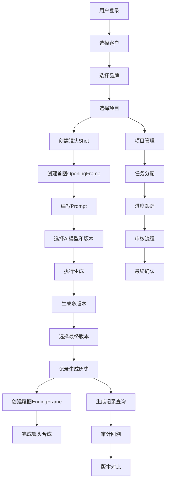

## 1. 产品概述

AIGC数字资产管理Web端是一个基于模拟数据的前端管理界面，专注于广告视频生成业务的完整管理流程。系统采用三级层级结构（客户→品牌→项目）组织数据，提供内容创作（首图/尾图生成、镜头管理）、项目管理（客户/品牌/项目/简报/任务/审核）和系统配置（角色权限）三大核心模块。所有视频生成操作基于最小颗粒度"项目"进行，确保生成过程完整可追溯。

## 2. 核心功能

### 2.1 用户角色
| 角色 | 核心权限 |
|------|----------|
| 项目经理 | 全项目访问、任务分配、进度管理、生成记录审计 |
| 创意人员 | 内容创作、Prompt编写、资产管理 |
| 图像操作员 | 首图/尾图生成操作、模型版本选择 |
| 视频操作员 | 镜头管理、视频资产合成 |
| 审核人员 | 内部审核、评论、版本选用决策 |
| 客户审核员 | 客户端审核、只读访问、最终确认 |

### 2.2 业务逻辑说明

**三级层级结构**：
- **客户(Client)**：最上级组织单元，一个客户可拥有多个品牌
- **品牌(Brand)**：中间层组织单元，一个品牌可包含多个项目
- **项目(Project)**：最小颗粒度操作单元，所有视频生成必须基于具体项目进行

**视频生成流程**：
1. 选择具体项目作为基准
2. 创建镜头(Shot)，每个镜头包含首图(Opening Frame)和尾图(Ending Frame)
3. 为每张图片编写对应Prompt提示词
4. 选择AI模型及版本进行生成
5. 生成多个版本供选择
6. 记录生成历史（模型名称、版本号、生成版本数量、最终选用版本标识）
7. 完成镜头合成，形成完整广告视频

**生成记录与追溯**：
- 系统记录每次生成的完整信息
- 支持按模型、版本、时间筛选查询
- 支持审计和历史回溯
- 显示最终选用版本标识

### 2.3 功能模块
1. **内容创作模块**：首图/尾图管理、镜头管理、资产管理、生成记录查询
2. **项目管理模块**：客户管理、品牌管理、项目管理、简报管理、任务管理、审核管理
3. **系统配置模块**：角色权限管理、系统设置

### 2.4 页面详情
| 页面名称 | 模块名称 | 功能描述 |
|----------|----------|----------|
| 内容创作-首图/尾图 | 列表页 | 分页列表、状态筛选、Prompt编辑、模型选择、版本管理 |
| 内容创作-镜头 | 列表页 | 分页列表、项目筛选、首图/尾图关联、生成记录展示 |
| 内容创作-资产 | 列表页 | 分页列表、类型筛选、状态管理、上游依赖追溯 |
| 内容创作-生成记录 | 历史记录 | 模型/版本筛选、生成时间线、选用版本标识 |
| 项目管理-客户 | 列表页 | 客户信息CRUD、联系人管理、品牌关联 |
| 项目管理-品牌 | 列表页 | 品牌信息CRUD、关联客户、项目列表 |
| 项目管理-项目 | 列表页 | 项目进度展示、风险等级、负责人管理、视频生成入口 |
| 项目管理-简报 | 列表页 | 简报详情、目标受众、交付平台、文件上传 |
| 项目管理-任务 | 列表页 | 任务状态跟踪、负责人分配、类型筛选 |
| 项目管理-审核 | 列表页 | 审核状态、评论、时间戳、版本选择决策 |
| 系统配置-角色 | 权限管理 | 角色绑定、可见性控制 |
| 系统配置-设置 | 系统设置 | 基础配置、模型管理、主题切换 |

## 3. 核心流程

## 4. 用户界面设计

### 4.1 设计风格
- **主色调**：深蓝色系 (#1a1a2e) 作为背景，搭配珊瑚橙 (#ff6b6b) 作为强调色
- **辅助色**：青绿色 (#4ecdc4) 用于成功状态，琥珀色 (#feca57) 用于警告
- **按钮样式**：圆角矩形，带微妙阴影和悬停动画效果
- **字体**：标题使用"Playfair Display"，正文使用"Source Sans Pro"
- **布局风格**：卡片式布局，左侧导航栏，顶部操作栏
- **图标风格**：使用Lucide图标库，简洁线性风格
- **动效**：页面切换淡入淡出，列表项加载渐显动画，按钮点击缩放效果

### 4.2 页面设计概览
| 页面名称 | 模块名称 | UI元素 |
|----------|----------|--------|
| 内容创作列表 | 列表表格 | 卡片容器、状态标签、操作按钮、分页器 |
| 项目管理列表 | 列表表格 | 进度条、风险指示器、状态徽章 |
| 表单模态框 | 创建/编辑 | 表单字段、验证提示、提交按钮 |
| 侧边栏导航 | 菜单 | 图标+文字、展开/折叠、当前高亮 |
| 顶部操作栏 | Header | 面包屑、搜索框、用户头像 |

### 4.3 响应式
- 桌面端优先设计，适配1920px、1440px、1280px分辨率
- 侧边栏可折叠，最小宽度80px（图标模式）
- 表格列支持横向滚动，移动端隐藏次要列
- 触摸设备优化：按钮最小触控区域44px
