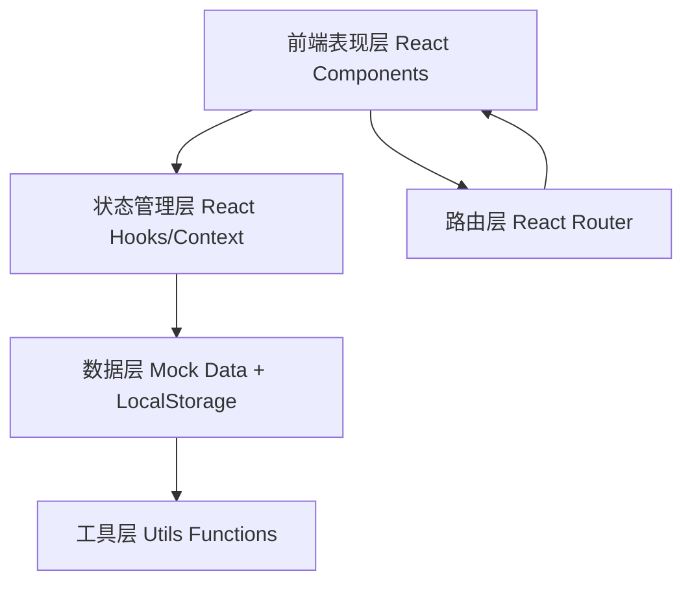
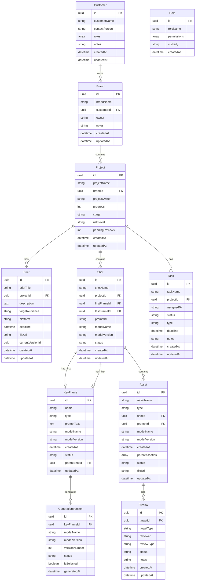

## 1. 架构设计

## 2. 技术说明

- 前端框架：React@18 + Vite
- 样式方案：CSS变量 + CSS Modules
- 路由管理：React Router DOM@6
- 图标库：Lucide React
- 构建工具：Vite@5
- 数据模拟：LocalStorage + Mock JS数据
- 状态管理：React Context + useReducer

## 3. 路由定义

| 路由 | 用途 |
|------|------|
| / | 重定向到/dashboard |
| /dashboard | 仪表盘首页 |
| /content/keyframes | 首图/尾图列表 |
| /content/shots | 镜头列表 |
| /content/assets | 资产列表 |
| /projects/customers | 客户列表 |
| /projects/brands | 品牌列表 |
| /projects/projects | 项目列表 |
| /projects/briefs | 简报列表 |
| /projects/tasks | 任务列表 |
| /projects/reviews | 审核列表 |
| /system/roles | 角色权限管理 |
| /system/settings | 系统设置 |

## 4. 数据模型

### 4.1 数据模型定义

### 4.2 生成记录字段说明

**GenerationVersion表**：
- `id`：UUID，版本唯一标识
- `keyFrameId`：关联的首图/尾图ID
- `modelName`：使用的AI模型名称
- `modelVersion`：模型版本号
- `versionNumber`：生成的版本号序号（1,2,3...）
- `status`：生成状态（Pending/Completed/Failed）
- `isSelected`：是否被选为最终版本
- `generatedAt`：生成时间戳

### 4.3 审计追溯字段

所有核心对象包含：
- `createdAt`：创建时间
- `updatedAt`：最后更新时间
- 生成记录完整保留，不被删除，仅状态变更
